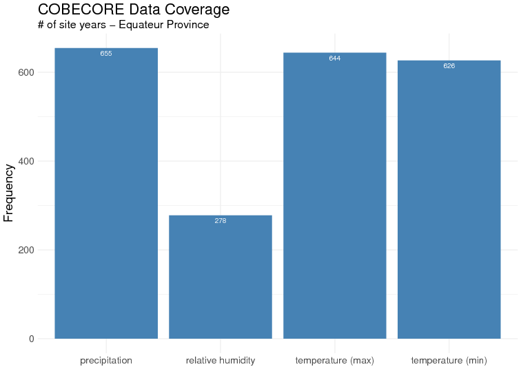
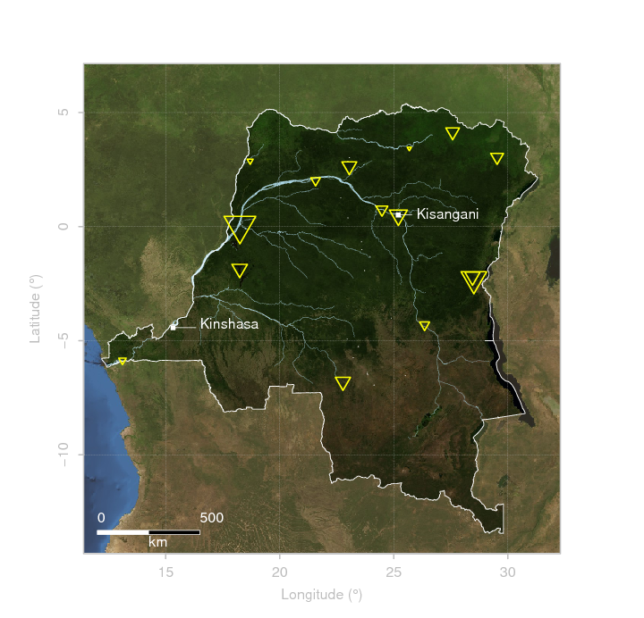
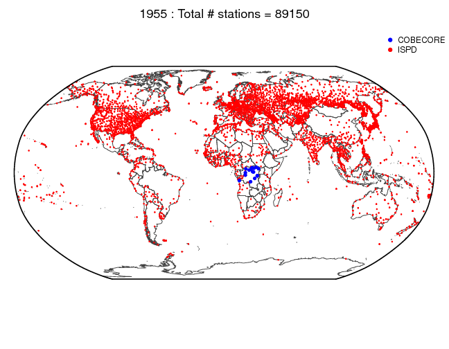

# COBECORE data availability

This repository stores data regarding available eco-climatological data as processed in the [COBECORE project](http://cobecore.org), and provides summary statistics to aid in the transcription process and evaluation of the eco-climatological dataset.

## Before you start

Make sure to have running copy of the [R statistical framework](https://cloud.r-project.org/), and [rstudio](https://www.rstudio.com/products/rstudio/download/#download) on your computer. Library dependencies are listed at the top of each R script.

## Download

clone the project to your home computer using the following command (with git installed)

```
git clone https://github.com/khufkens/cobecore_data_availability.git
```

Alternatively, download the project using download button.

## Run analysis

All data is stored in the "data" folder of the project, code for post-processing and visualizations can be found in the "src" folder. All source code should run relative to the project path, and loaded correctly when opening the R project file.

## Results

The code produces, among others, the following summary graphs on data availability within the COBECORE project. Data will be updated when they become available.

### overall overage (currently quantified)


### surface pressure stations

Two maps are provided, a detailed map and, an overview map providing context within a global setting. Yellow triangles are proportional to the available number of site years. The global map shows all stations available until 1955 within [the ISPD project,](https://reanalyses.org/observations/international-surface-pressure-databank) and how COBECORE contributes data within this same time frame, filling an obvious spatio-temporal gap in knowlege for the Congo Basin.






### Copyright notice

All data is copyright of the respective partner institutes until official release to a public domain license on a later data.